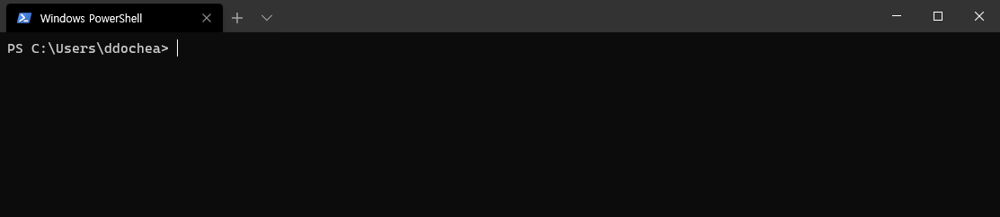

# shellcut
Create shortcut commands and easily call them when needed.

## How to install
```
npm install -g shellcut
```

## Quick start
Create shellcut example.
```cmd
shellcut create hw "echo hello shellcut!"
```
Type this.
```
__hw
```


## Why is '__' include?
Because, it helps you find the existed shellcut quickly by pressing the Tab key. 
Other words ($, @,%, etc) are already in use or cannot be used in shell, powershell, cmd, etc.

## Commands
### create
Create new shellcut command.
```cmd
shellcut create <shellcut> <original command>
```
### list
Show existed shellcuts.
```cmd
shellcut list
```
If you want to filtered by name, use option '--call' or '-c'.
'word' is used to search by contains of shellcut name condition.
```cmd
shellcut list --call <word>
```
If you want to filtered by original comand, use option '--cmd' or '-o'. 
'word' is used to search by contains of command condition.
```cmd
shellcut list --cmd <word>
```
You can use both options.
```cmd
shellcut list --call <word1> --cmd <word2>
```
### remove
remove existed shellcut.
```cmd
shellcut remove <shellcut>
```
